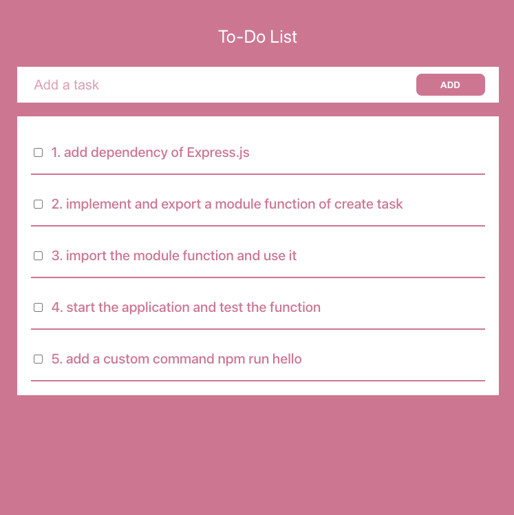

# Todolist



This is an example project for learning nodejs, which is a to-do list with 3 feature, display all list, mark a task as done and create a new list.
We will write some nodejs code to finish the backend service, the frondend is a simple ReactJs project which will send request to backend, in this project we only need to finish the backend part, don't need to change any frontend code.

## How to start
1.Open two terminal window

Terminal window 1 (For frontend):
```
cd frontend
npm install
npm start
```

it will run at [http://localhost:3000](http://localhost:3000)

Terminal window 2 (For backend):
```
cd backend
npm install
```

2.Follow Hints ine the Go to the [readme file](./backend/README.md) under the `backend` folder and start

## Backend project
It will run at [http://localhost:3001](http://localhost:3001)

### Existing api

`GET /` (will get all of the items)

`POST /done` (mark the task as done)

### To be done api

`POST /` (create a new task)
